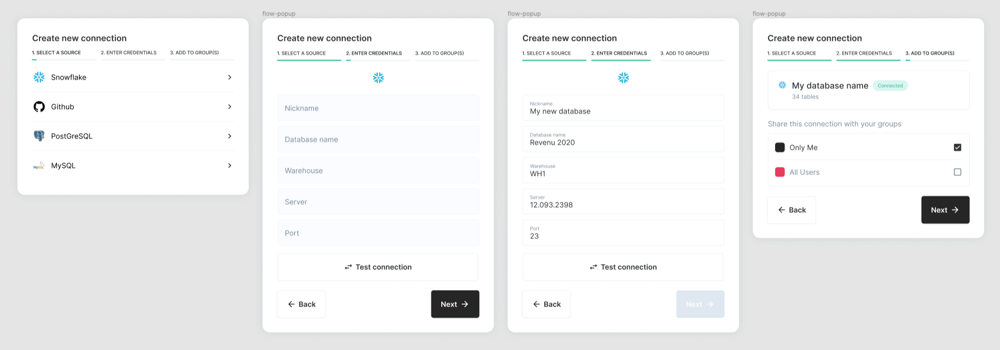

# Implement UI to create a connection

### Background

This repo contains a basic React app with elementary UI components.

### Task

Implement the UI described in [this Figma file](https://www.figma.com/file/fC6F4jE9LR8HgAgQeTPb6t/iv-connection).

* Take advantage of existing components, whenever possible.
* Adhere to existing coding conventions.
* Do not rely on third-party UI libraries, such as Bootstrap or Material UI, unless it's a complex component.
* The list of available database connectors is [here](https://github.com/get-openlytics/iv-connection/blob/master/src/mocks/responses/getConnectors.json).
* Bonus: Implement the interaction to Test Connection, using mocked responses.

